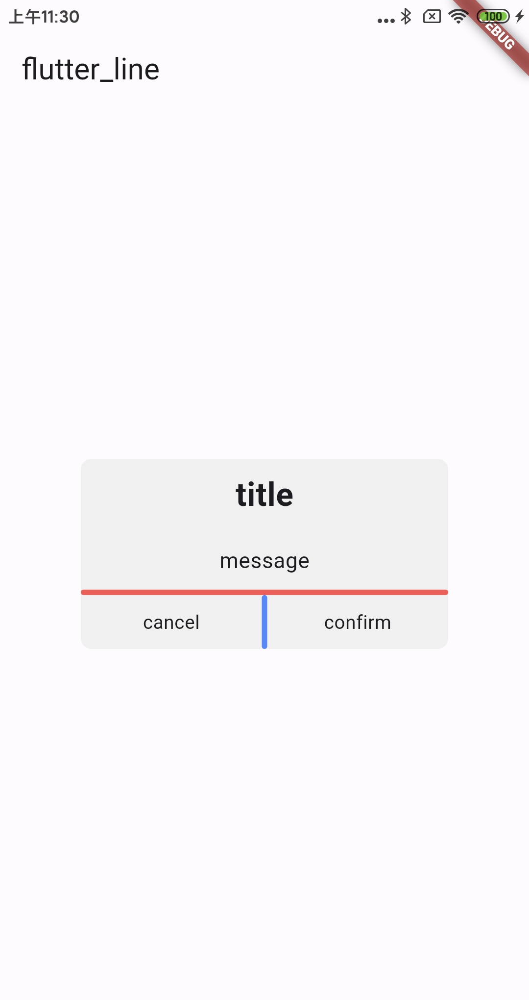

[](https://pub.dev/packages/flutter_line)

# flutter_line

Flutter 实现横竖向的分割线.

- 支持横向分割线(类似系统的`Divider`)
- 支持竖向分割线(类似系统的`VerticalDivider`)
- 支持自定义分割线的宽度, 颜色, 高度, 间距等属性
-  支持分割线的`match_parent`效果, `VerticalDivider`无法支持, 需要强制指定高度才行.



## Installation

安装最新版本 [](https://pub.dev/packages/flutter_line/install)

## Quick Start

```dart

/// 横线, 默认
Line(axis: Axis.horizontal);

/// 竖线
Line(axis: Axis.vertical);
```

支持的属性:

```dart
/// 是否强制指定线条的大小
double? lineSize;

/// 线条的厚度
double thickness;

/// 线条的方向
Axis axis;

/// 缩进
double? indent;
double? endIndent;

/// 线条的颜色
Color color;

/// 线条的外边距
EdgeInsets? margin;
```

## License

MIT License

Copyright (c) 2023 angcyo